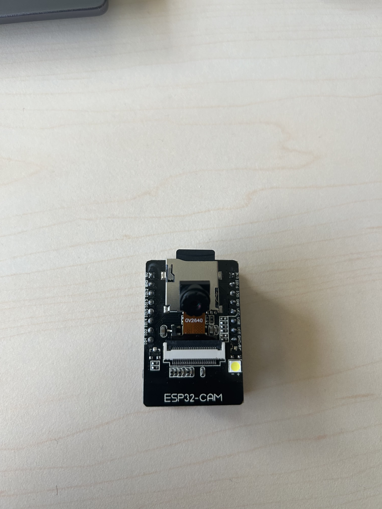

# Contrôleur de Pointeur Laser via Caméra

Ce projet IoT consiste à mettre en place un serveur avec une API REST hébergée localement sur l'ESP32-CAM. Cette API intègre un modèle de TinyML pour la reconnaissance d'objets, en l'occurrence des humains, généré avec le framework Edge Impulse. L'objectif principal est que lorsque le modèle détecte un humain, il sérialise la bounding box et la stocke sur le serveur pour qu'elle puisse être récupérée par l'API. Ensuite, un serveur de calcul pourra exécuter fetch_data_from_esp.py pour récupérer les données de l'API et les transformer afin d'orienter la trajectoire du pointeur laser. Ces données transformées seront ensuite renvoyées à l'ESP, qui avertira la tourelle pour qu'elle ajuste sa position en conséquence.

## Installation

#### Environnement Python 

```shell
python3 -m venv iot_venv
source iot_venv/bin/activate
pip install -r requirement.txt
```
#### Environnement Arduino

Ajoutez `ei-iot-tracking-arduino-1.0.1.zip` à vos librairies via `sketch > include library > add .ZIP library...` dans l'IDE ARDUINO.

Ensuite toujours dans l'IDE, installer les bibliotèques suivantes :
* `Servo.h`
* `ezButton.h`
* `ArduinoJson.h`

## Matériel Requis

#### Partie Pointeur Laser
- Arduino Uno R3
- Module Laser Rouge VMA434
- 2 Servomoteurs Classiques

#### Partie Caméra
- ESP32-CAM (AI THINKER ESP32CAM)

## Schema et Photo du Projet 

#### Schema de montage


#### Photo du projet




## Description de l'objet
Notre projet est composé d'une carte Arduino, d'une carte ESP32 codée en C sur laquelle tourne un algorithme de machine learning, une tourelle, un Joystick et d'un serveur de calcul. Au niveau des capteurs il est composé d'une caméra  et d'un joystick. 
Le Joystick permet de controler la tourelle et de pointer le laser sur une personne manuellement. 

### Fonctionnement général de L'IOT
Lorsque la caméra détecte une personne grâce à un modèle d'apprentissage, la tourelle pivote pour pointer un rayon laser vers la personne détectée. Un mode manuel est également disponible en appuyant sur le joystick.

### Fonctionnement détaillé de l'IOT

La carte Arduino est connectée en série au bloc caméra (capteur caméra + ESP32). Ce bloc expose une API REST permettant de récupérer les données de détection de la caméra (fournis par le model TINYML hébergé sur le bloc).

Le PC récupère les données de la bounding box du JSON en utilisant la méthode GET (/MLData) de l'API. Il calcule ensuite l'angle nécessaire pour que la tourelle vise la personne détectée.

Le PC envoie cet angle via l'API (/set?x=&y=) à la caméra, qui le transmet en série à la carte Arduino. Cette dernière, connectée à la tourelle, fait pivoter celle-ci pour viser la personne détectée.

Enfin, le PC envoie les données au Broker MQTT à l'aide d'une librairie de client MQTT.

## Contributeurs

Voici la liste des personnes ayant contribué à ce projet :

- **[Donat Fortini](https://github.com/DonatFortini)** - Montage, API, ML, commentaires, Readme
- **[Paul-Antoine Vinciguerra](https://github.com/Pavellow)** - Calcul de trajectoire, schema, cahier des charges, montage tourelle .
- **[Ilyas Bensalem](https://github.com/BensalemIlyas)** - Communication MQTT, Readme, rapport word.


